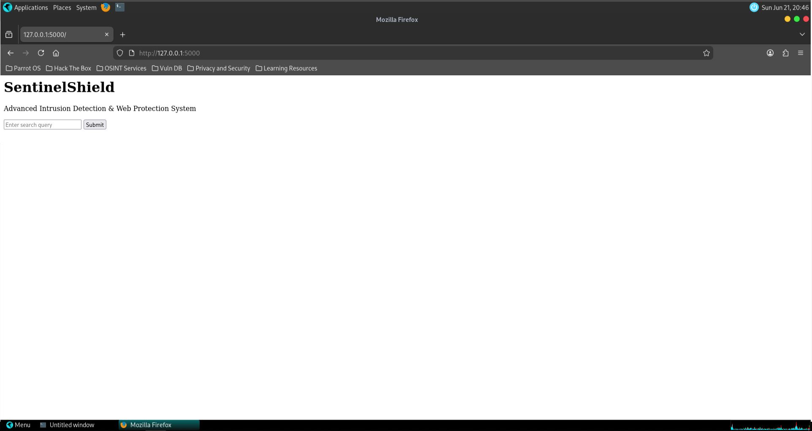
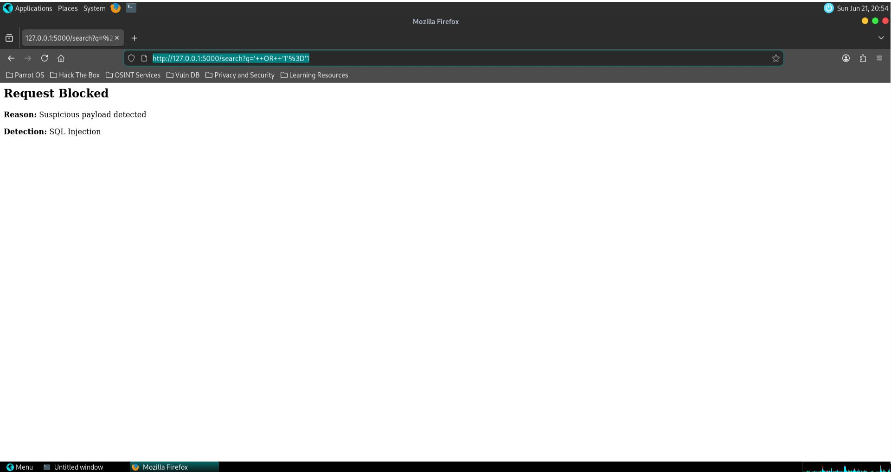
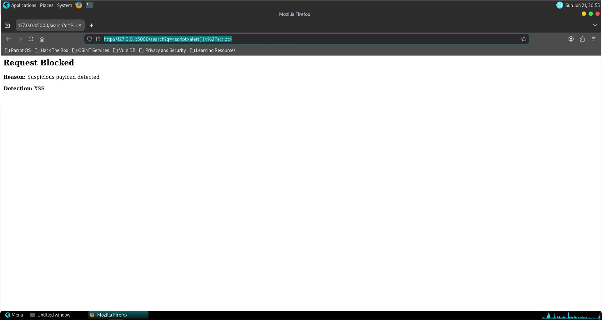
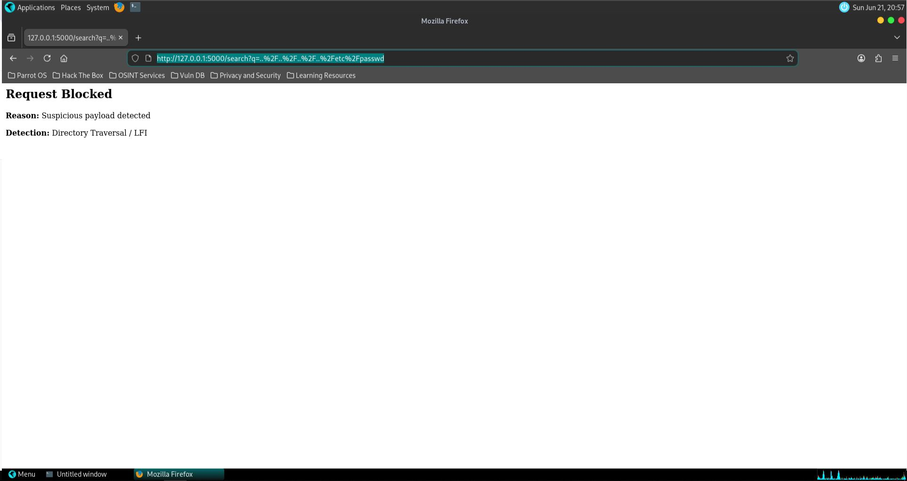
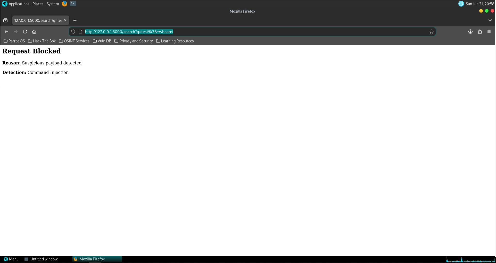
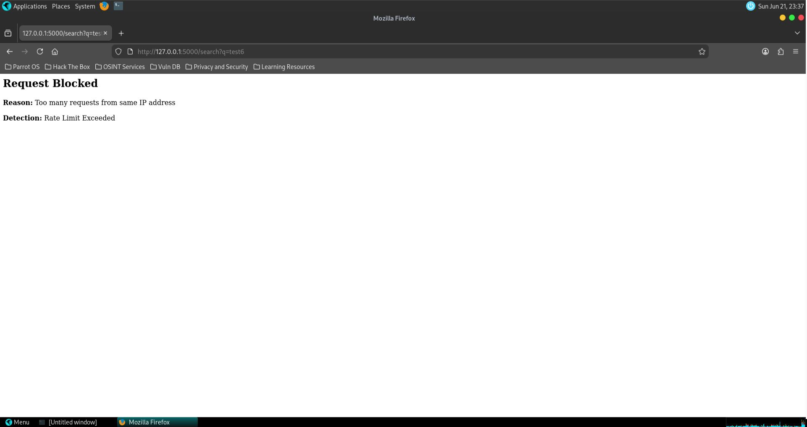
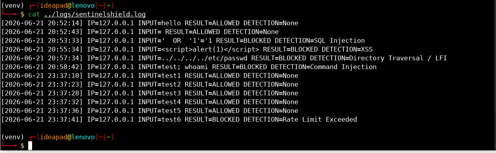
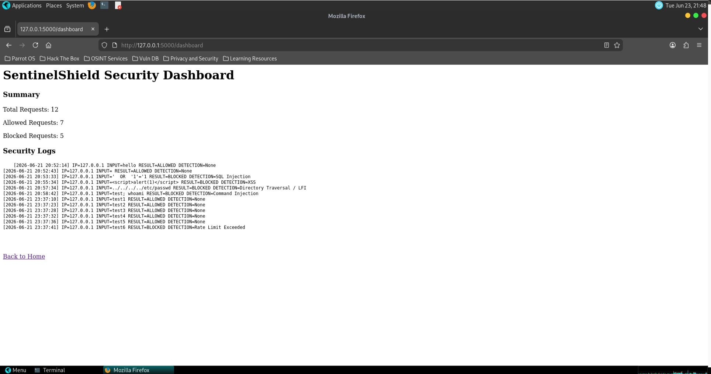
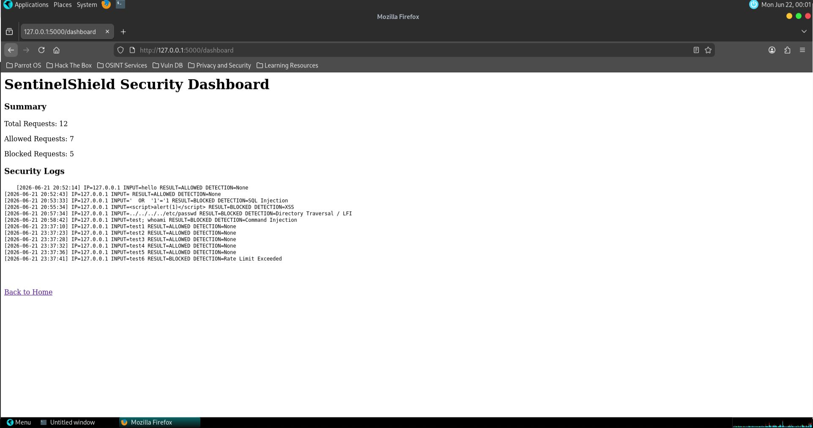

# Practical Journal

## SentinelShield: Advanced Intrusion Detection & Web Protection System

## 1. Purpose of the Experiment

The purpose of this practical work was to develop and test a simplified Intrusion Detection and Web Protection System named SentinelShield. The system simulates the behavior of a lightweight Web Application Firewall by inspecting HTTP requests, detecting malicious input patterns, applying rate limiting, generating logs, and displaying security events through a dashboard.

This practical helped demonstrate the workflow of:

```text
Request Inspection → Detection → Decision → Logging → Dashboard Visibility
```

## 2. Tools Used

| Tool / Technology | Purpose                                |
| ----------------- | -------------------------------------- |
| Parrot OS         | Cybersecurity lab environment          |
| VirtualBox        | Running Parrot OS as a virtual machine |
| Python 3          | Application development                |
| Flask             | Web application framework              |
| Browser           | Manual request testing                 |
| Linux Terminal    | Running commands and viewing logs      |
| Nano Editor       | Editing source code in Parrot OS       |
| Windows           | Documentation and GitHub preparation   |

## 3. System Setup

The project folder was created inside Parrot OS. A Python virtual environment was used to isolate dependencies from the system Python installation.

The main project structure included:

```text
SentinelShield/
├── architecture/
├── logs/
├── screenshots/
├── src/
├── test-payloads/
├── requirements.txt
├── README.md
└── practical-journal.md
```

The Flask application was created inside the `src` directory using the main file:

```text
src/app.py
```

## 4. Step-by-Step Execution

### Step 1: Basic Flask Application

A basic Flask web application was created with a homepage and a search form. The form accepted user input through the `q` parameter.

**Observation:**
The web application opened successfully on:

```text
http://127.0.0.1:5000
```

**Screenshot:**


---

### Step 2: HTTP Request Inspection

The application was updated to read input from the HTTP GET request parameter.

**Observation:**
The system was able to receive user input and display whether the request was allowed or blocked.

---

### Step 3: Rule-Based Attack Detection

A rule-based detection engine was added. The engine compared user input against predefined attack signatures.

The detection categories included:

* SQL Injection
* Cross-Site Scripting
* Directory Traversal / LFI
* Command Injection

---

### Step 4: SQL Injection Testing

A SQL Injection payload was submitted:

```text
' OR '1'='1
```

**Observation:**
The system detected the payload as SQL Injection and blocked the request.

**Screenshot:**


---

### Step 5: XSS Testing

An XSS payload was submitted:

```text
<script>alert(1)</script>
```

**Observation:**
The system detected the payload as XSS and blocked the request.

**Screenshot:**


---

### Step 6: Directory Traversal / LFI Testing

A directory traversal payload was submitted:

```text
../../../../etc/passwd
```

**Observation:**
The system detected the payload as Directory Traversal / LFI and blocked the request.

**Screenshot:**


---

### Step 7: Command Injection Testing

A command injection payload was submitted:

```text
test; whoami
```

**Observation:**
The system detected command injection indicators and blocked the request.

**Screenshot:**


---

### Step 8: Rate Limiting Test

Multiple normal requests were submitted quickly from the same IP address.

**Observation:**
After more than 5 requests within 60 seconds, the system blocked the request as abusive traffic.

**Screenshot:**


---

### Step 9: Log File Examination

The generated log file was reviewed.

The log entries contained:

* Timestamp
* IP address
* Input value
* Request result
* Detection category

**Screenshot:**


---

### Step 10: Dashboard Testing

A dashboard route was added at:

```text
http://127.0.0.1:5000/dashboard
```

The dashboard displayed:

* Total requests
* Allowed requests
* Blocked requests
* Raw security logs

**Screenshot:**


---

### Step 11: Dashboard Stored XSS Fix

During dashboard testing, it was observed that raw log entries could execute an XSS payload in the browser. This created a stored XSS risk in the dashboard.

The issue was fixed by applying HTML escaping before displaying logs.

**Observation:**
After the fix, malicious payloads were displayed as text and did not execute.

**Screenshot:**


## 5. Log Interpretation

The log file showed both allowed and blocked requests. Malicious inputs were categorized based on matched attack signatures.

Example log format:

```text
[YYYY-MM-DD HH:MM:SS] IP=127.0.0.1 INPUT=<payload> RESULT=BLOCKED DETECTION=XSS
```

The logs helped identify:

* Which payloads were blocked
* Which attack category was detected
* Which IP address generated the request
* Whether normal requests were allowed
* Whether abusive repeated requests were blocked

## 6. Observations

* Normal requests were allowed successfully.
* SQL Injection payloads were blocked.
* XSS payloads were blocked.
* Directory Traversal / LFI payloads were blocked.
* Command Injection payloads were blocked.
* Repeated requests were blocked by the rate limiter.
* Logs were generated for each request.
* Dashboard visibility helped summarize system activity.
* Output encoding was required to safely display malicious log entries.

## 7. Conclusion

The practical work successfully demonstrated a simplified intrusion detection and web protection workflow. SentinelShield inspected incoming HTTP requests, detected common web attack patterns, applied rate limiting, generated logs, and displayed security events through a dashboard.

The project also demonstrated an important security lesson: even internal dashboards must safely encode output to prevent stored XSS.
